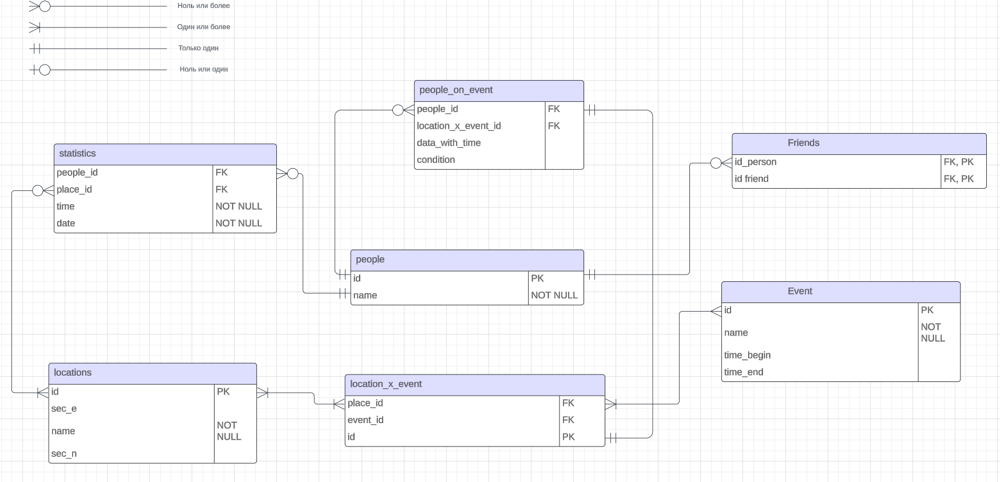

# Проект для курса базы данных
## Описание проекта
### Тема
- База данных для телеграм бота Физтех.Сигаретка

### Мотивация
- База данных создается для бота. Бот создается для более удобного способа позвать друзей выйти на улицу покурить.

### Функции базы данных

- Добавление друзей, которых будешь звать к своему месту нахождения

- Составление статистики курения

- Периодические мероприятия, связанные с курением, в которые можно вступить

### Описание структуры базы данных

#### Cущности:

- Пользователи

- Статистика - данные с временем и датой выхода покурить (для каждого человека)

- Друзья (для каждого человека)

- События - начало, конец события, люди, подписанные на событие

- Локации - места на физтехе и их координаты

## Проектирование

### Концептуальная модель

### Логическая модель

    
### Физическая модель

